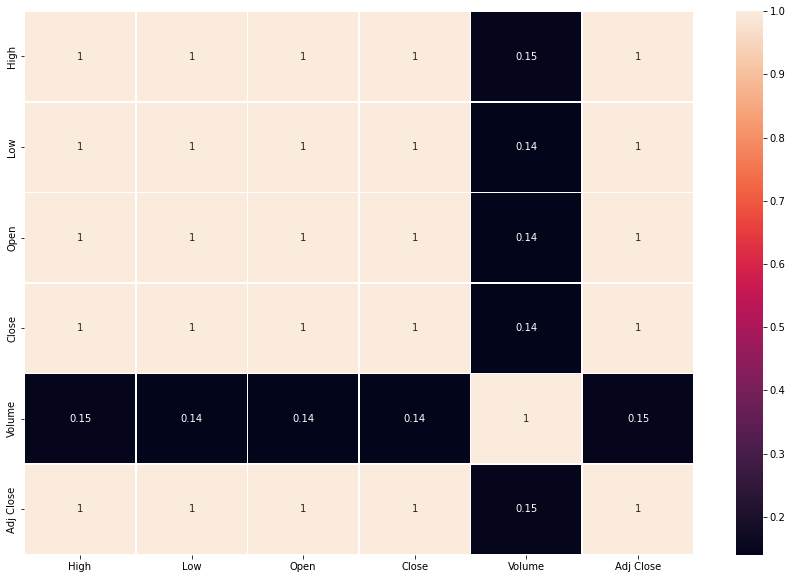

# Laporan Proyek Machine Learning - Melina Dwi Safitri

## Domain Proyek
Dalam bidang perekonomian suatu negara dipengaruhi oleh pasar saham/modal yang didalamnya terdapat proses jual beli daham sesuai dengan harga yang ada dipasar.<br>

Melihat kondisi pasar saham dalam negeri khusus nya BCA setiap harinya mengalami naik turun tidak menentu maka perlu untuk mempelajari data masa lalu dari perbankan, untuk strategi investasi kedepannya. Sehingga Investor dapat melakukan analisis terhadap perusahaan yang akan diinvestasikan. <br> 
sumber = [ANALISIS PREDIKSI HARGA SAHAM SEKTOR PERBANKAN 
MENGGUNAKAN ALGORITMA LONG-SHORT TERMS MEMORY
(LSTM)](http://www.jurnal.upnyk.ac.id/index.php/semnasif/article/view/4135)<br>
Maka perlu dilakukanlah proses pengolahan dan pelatihan data menggunakan suatu algoritma sehingga data tersebut dapat digunakan untuk memprediksi harga saham untuk *next day*. 

## Business Understanding
Untuk menyelesaikan permasalahan itu akan dimulai dengan analisis isi dari data tersebut yang kemudian akan dibuat model dengan menggunakan deep learning LSTM.
### Problem Statements
- Apakah algoritma yang bisa digunakan untuk kasus ini?
- Apakah data yang digunakan memiliki tingkat error yang besar?
- Bagaimana cara menentukan prediksi price close untuk next day menggunakan *time series*?

### Goals
- Proyek ini bertujuan untuk memprediksi harga *close* untuk harga saham BCA, dengan mengimplementasikan *machine learning* didalamnya sehingga lebih mempermudah proses.
- Membentuk model yang optimal dengan data *Time Series*

### Solution statements
Untuk menentukan prediksi *price close next day* algoritma yang digunakan adalah *Deep Learning (convolutional LSTM)*, LSTM digunakan karena dapat mengolah data yang besar dengan urutan yang kompleks (*time series*). LSTM bekerja dengan mempelajari urutan data menggunakan blok memori yang terhubung dengan lapisan neuron.
Sedangkan untuk mengetahui data yang digunakan sesuai dan tidak banyak terdapat error dapat dilakukan dengan exploratory data analysis, dan ketika model sudah selesai training, model akan di evaluasi dengan menggunakan MAE (*Mean Absolute Error*), MAPE(*Mean Percentage Absolute Error*), MDAPE(*Median Absolute Percentage Error*), MSE(*Mean Squared Error*) dan RMSE (*Root Mean Squared Error*). 


## Data Understanding
Data yang digunakan adalah dataset *stock price* dari BCA yang diambil dari tahun 2010 sampai 2020 dari Yahoo Finance <br>
[Data History BCA Stock price](https://finance.yahoo.com/quote/BBCA.JK/history?p=BBCA.JK ) 

Data yang digunakan berjumlah 2731 data.


Ada beberapa variable dalam data tersebut yaitu:

1. Low : harga terendah dalam pergerakan harga setelah harga dibuka hingga close
2. High: harga tertinggi dalam pergerakan harga, dalam hal ini biasanya ketika data semakin tinggi maka akan ada orang yang membeli
3. Open : harga awal ketika transaksi pertama kali di lakukan pada hari itu. Harga diambil dari harga close hari sebelumnya
4. Close : harga terakhir, harga ini penting karena penting untuk proses anaisys
5. Volume : berapa banyak transaksi yang terjadi, dalam jumlah per-lembar
6. Adj Close : harga akhir/penutupan yang sudah disesuaikan dengan aksi  korporasi, kserti isu ekonomi, politik dll.

Keenam variable data memiliki type float. 

## Data Eksploration 

Eksplorasi data bertujuan untuk mengetahui apa saja jenis data yang ada di dalam dataset yang digunakan 

* Mengecek data yang mengalami mising value atau tidak. <br>
Setelah pengecekan ternyata tidak ada data yang mengalami missing value
* mengecek data yang mengalami duplicate
diketahui bahwa ada sebanyak 30 yang mengalami duplicated


<br> 
Untuk mengatasi itu dilakukan penghapusan data yang mengalami duplikat

* cek Deskripsi statistika dengan menggunakan ```data.describe() ```


Diketahui data Volume memiliki nilai minimal 0 maka cek lokasi tersebut dan penyebab data tersebut bernilai nol

 


Data Volume bernilai 0 dikarenakan pada hari itu tidak terjadi proses transaksi

* visualisasikan data variabel 
    * visualisasi semua nama variable dengan histogram


    * visualisasi data Close berdasarkan index(rentang taun 2010-2020)


    * Visualisasi data open-close berdasarkan week/minggu dalam data ini ternyata proses dalam satu minggu hanya terjadi 5 kali transaksi saja menggunakan barplot
        * close Open Price 
        Data diambil dengan menentukan nilai gap dari close dan open dengan rumus:

        $open close week = (open - close)/close$

        
        * High Low Price

        

* cek korelasi antar data untuk mengetahui keterkaitan antar variable 


Berdasarkan data korelasi diketahui bahwa data memiliki range antara 0 - 1, variable/features yang mengalami korelasi data paling kecil adalah Volume

* Mengecek apakah data Close terdapat oulier atau tidak


Setelah dilakukan pengecekan ternyata tidak ada data yang mengalami outlier, maka tidak perlu dilakukan IQR.

## Data Preparation
setelah data di Eksplorasi data akan disiapkan supaya bisa digunakan untuk membuat model.
* Melakukan split data x dan y yang bertujuan y sebagi feature
split, dengan membuat step = 5 karena disini data yang akan digunakan untuk prediksi diambil per minggu. Kenapa data sibagi hanya 5 step? Karena proses beli dan jual saham dalam seminggu hanya berlangsung dalam 5 hari.
* Melakukan split data train, test, validation 
split data harus dilakukan sebelum pembuatan model karena harus tetap mempertahankan beberapa data yang digunakan untuk proses pengujian.<br>
data yang digunakan adalah data Close saja karena ingin memprediksi close next day, harga penutupan dari saham BCA. Dengan persentase :
    * Split data menjadi:
    * train = 70% 
    * test =  20%
    * validation =10%

Split data dilakukan tanpa melakukan random dan shuffle data untuk mengurangi perubahan urutan data
Setelah proses split data diketahui jumlah dari masing masing data train 1940, test 540 dan val 216
* Melakukan MinMaxScaler
Tujuan dari penggunaan MinMaxScaler ini untuk menyesuaikan rentang data 0-1 sehingga bisa mengurangi tingkat error, data yang di scall adalah data train 

Proses dialkuakn dengan menggunakan windowed dataset<br>
Menggunakan windowSize 10 dan batchsize=10(batch_size digunakan menjalankan berapa data yang akan di training untuk setiap epochs misal
terdapat 1936 data dengan batch sizenya 10 maka 1936/10 = 193 kali untuk setiap epochs)


## Modeling
Model yang digunakan adalah model Convolutional LSTM, model ini digunakan karena dapat menangani data yang banyak dan lebih sederhana dalam implementasiannya, disini menggunakan Conv1D dengan pengaturan stride 2, yang memiliki arti perubahan pergerakan per dua data untuk perhitungannya, dengan 2 layer LSTM.<br>

Atur compile data sebelum proses training, dengan ketentuan loss=mean_squared error, dan optimizer yang digunakan Adam , karena adam memiliki tingkat optimizer yang lebih tinggi dan cenderung stabil


Kemudian setelah model terbentuk lakukan training data untuk prosesnya dijalankan sebanyak 10 epochs


Berdasarakan plot diatas data training diatas nilai mae terendah yaitu 0.015 (1.5%)

## Evaluation Model
* Evaluasimodel dilakukan untuk mengetahui bagaimana performa dari data kita dengan menerapkan metric MSE, MAE, dam RMSE

* Pertama dilakukan predict data berdasarkan data test data test dilakukan reshape ukuran dimesi menjadi 3 dimensi 

* Lalu dilakukan pengecekan nilai prediksi pada data test

* Setelah itu unscaled data prediksi


Berdasarkan hasil evaluasi error diketahui data presentasi error yaitu 10.74% sedangkan median dari error adalah 9.14% yang mengindikasikan ada berapa data yang memiliki outlier dalam proses prediksi. 

Pesentase MAPE 10.74% presentasi itu menurut Lewis(1982) masih tergolong baik.

## Prediction Next Day


Berdasarkan hasil diatas diketahui data untuk next day masih kurang sesuai karena memiliki nilai yang lebih besar diabandingkan dengan data yang asli


