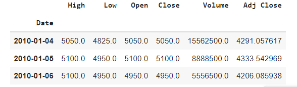
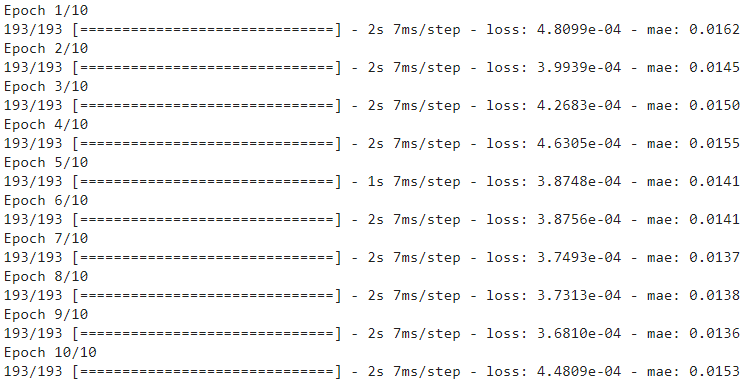
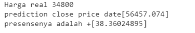

# Laporan Proyek Machine Learning - Melina Dwi Safitri

## Domain Proyek
Dalam bidang perbankan khususnya saham kadang harga close untuk minggu selanjutnya belum bisa untuk ditentukan, sehingga diperlukan cara untuk mempermudah permasalahan tersebut


## Business Understanding
Bagian ini menjelaskan proses klarifikasi masalah dan mengajukan minimal satu solusi untuk menyelesaikan permasalahan. Bagian laporan ini mencakup:

### Problem Statements
- Bagaimana cara menentukan prediksi price close minggu depan?
- Bagaimana membangun machine Learning yang sesuai dengan data bentuk Time Series?

### Goals
- Proyek ini bertujuan untuk memprediksi harga close untuk harga saham BCA, dengan mengimplementasikan machine learning didalamnya sehingga lebih mempermudah proses
- Membentuk model yang optimal dengan data Time Series

### Solution statements
untuk mengatasi permasalahan disini menggunakan satu algoritma yaitu Convolutional LSTM

## Data Understanding
Data yang digunakan adalah dataset stock price dari BCA yang diambil dari tahun 2010 sampai 2020 dari Yahoo Finance <br>
[Data History BCA Stock price](https://finance.yahoo.com/quote/BBCA.JK/history?p=BBCA.JK ) 

Data yang digunakan berjumlah 2731 data.



ada beberapa variable dalam data tersebut yaitu:

1. Low : harga terendah dalam pergerakan harga setelah harga dibuka hingga close
2. High: harga tertinggi dalam pergerakan harga, dalam hal ini biasanya ketika data semakin tinggi maka akan ada orang yang membeli
3. Open : harga awal ketika transaksi pertama kali di lakukan pada hari itu. Harga diambil dari harga close hari sebelumnya
4. Close : harga terakhir, harga ini penting karena penting untuk proses anaisis
5. Volume : berapa banyak transaksi yang terjadi, dalam jumlah per lembar
6. Adj Close : haraga akhir/penutupan yang sudah disesuaikan dengan aksi  korporasi, kondisi yang terjadi seperti isu isu yang sedang terjadi 

ke-6 variable data memiliki type float semua. 

## Data Eksploration 

Eksplorasi data bertujuan untuk mengetahui apa saja jenis data yang ada di dalam dataset yang digunakan 

* Mengecek data yang mengalami mising value atau tidak. <br>
Setelah pengecekan ternyata tidak ada data yang mengalami missing value
* mengecek data yang mengalami duplicate
diketahui bahwa ada sebanyak 30 yang mengalami duplicated


<br> 
untuk mengatasi itu dilakukan penghapusan data yang mengalami duplikat

* cek Deskripsi statistika dengan menggunakan ```data.describe() ```


Diketahui data Volume memiliki nilai minimal 0 maka cek lokasi tersebut dan penyebab data tersebut bernilai nol
 
Data Volume bernilai 0 dikarenakan pada harii itu tidak terjadi proses transaksi

* visualisasikan data variabel 
    * visualisasi semua nama variable dengan hisogram

    * visualisasi data Close berdasarkan index(rentang taun 2010-2020)

    * Visualisasi data open-close berdasarkan week/minggu dalam data ini ternyata proses dalam satu minggu hanya terjadi 5 kali transaksi saja menggunakan barplot
        * close Open Price 
        Data diambil dengan menentukan nilai gap dari close dan open dengan rumus:
        $ open close week = (open - close)/close$

        
        * High Low Price
        
* cek korelasi antar data untuk mengetahui keterkaitan antar variable 


Berdasarkan data korelasi diketahui bahwa data memiliki range antara 0 - 1, fitur yang mengalami korelasi data paling kecil adalah Volume

* Mengecek apakah data Close terdapat oulier atau tidak
[outlier_close](images/close_box.png)
Setelah dilakukan pengecekan ternyata data tidak mengalami outlier maka tidak perlu dilakukan IQR 

## Data Preparation
setelah data di Eksplorasi data akan disiapkan supaya bisa digunakan untuk membuat model
* Melakukan split data x dan y yang bertujuan y sebagi feature
split dilakukan dengan membuat step = 5 karena disini data yang akan digunakan untuk prediksi diambil per minggu, Kenapa data hanya 5 step? Karena prose stock price per week hanya terjadi selama 5 hari saja.
* Melakukan split data menjadi train, test, validation 
split data harus dilakukan sebelum pembuatan model karena harus tetap mempertahankan beberapa data yang digunakan untuk proses pengujian.<br>
data yang digunakan adalah data Close saja karena ingin memprediksi close next day, harga penutupan dari saham BCA. Dengan presentase :
    * Split data menjadi:
    * train = 70% 
    * test =  20%
    * validation =10%

split data dilakukan tanpa melakukan random dan shuffle data untuk mengurangi perubahan urutan data
Setelah proses split data diketahui jumlah dari masing masing data train 1940, test 540 dan val 216
* Melakukan MinMaxScaler
Tujuan dari penggunaan MinMaxScaler ini untuk menyesuaikan rentang data 0-1 sehingga bisa mengurangi tingkat error, data yang di scall adalah data train 

Proses dialkuakn dengan menggunakan windowed dataset<br>
Menggunakan windowSize 10 dan batchsize=10(batch-size digunakan menjalankan berapa data yang akan di training untuk setiap epochs misal
terdapat 1936 data dengan batch sizenya 10 maka 1936/10 = 193 kali untuk setiap epochs)


## Modeling
Model yang digunakan adalah model Convolutional LSTM, model ini digunakan karena dapat menangani data yang banyak dan lebih sederhana dalam pengimplementasiannya, disini menggu Conv1D dengan pengaturan stride 2, yang memiliki arti perubahan pergerakan data per 2 data.<br>

Atur compile data sebelum proses training, dengan ketentuan loss=mean_squared error, dan optimizer yang digunakan Adam , karena adam memiliki tingkat optimizer yang lebih tinggi dan cenderung stabil


kemudian setelah model terbentuk lakukan training data untuk prosesnya dijalankan sebanyak 10 epochs



## Evaluation Model
* Evaluasimodel dilakukan untuk mengetahui bagaimana performa dari data kita dengan menerapkan metric MSE, MAE, dam RMSE

* Pertama dilakukan predict data berdasarkan data test data test dilakukan reshape ukuran dimesi menjadi 3 dimensi 

* Lalu dilakukan pengecekan nilai prediksi pada data test

* Setelah itu unscaled data prediksi


Berdasarkan hasil evaluasi error diketahui data presentasi error yaitu 10.75 sedangkan media dari error adalah 9.14 yang mengindikasikan ada berapa data yang memiliki outlier dalam proses prediksi.

## Prediction Next Day



Berdasarkan hasil diatas diketahui data untuk next day masih kurang sesuai karena memiliki nilai yang lebih besar diabandingkan dengan data yang asli


